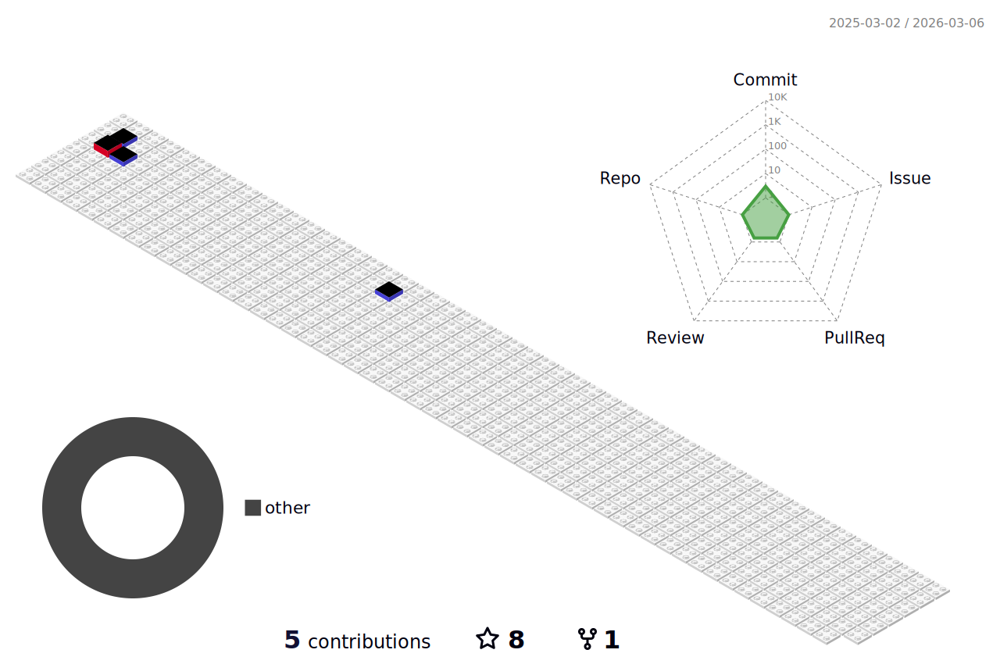

## Hi there 👋

<!--
**RainloongCao/RainloongCao** is a ✨ _special_ ✨ repository because its `README.md` (this file) appears on your GitHub profile.

Here are some ideas to get you started:

- 🔭 I’m currently working on ...
- 🌱 I’m currently learning ...
- 👯 I’m looking to collaborate on ...
- 🤔 I’m looking for help with ...
- 💬 Ask me about ...
- 📫 How to reach me: ...
- 😄 Pronouns: ...
- ⚡ Fun fact: ...
-->

### 🎓 Education
- First-year PhD student in Computer Science and Artificial Intelligence at Nanjing University of Science and Technology

### 👨‍💻 Work Experience
- Participated in the development of the SECEVERY homepage (https://sechub.com.cn/app/#/index/home).

### 🚀 About Me
- 🔭 Focusing on algorithm development and engineering implementation
- 🎯 Dedicated to computer vision
- 🤔 Is a rapper(NetEase CloudMusic: 沉梦昂志小粉丝)

<picture>
  <source media="(prefers-color-scheme: dark)" srcset="https://raw.githubusercontent.com/RainloongCao/RainloongCao/output/github-contribution-grid-snake-dark.svg">
  <source media="(prefers-color-scheme: light)" srcset="https://raw.githubusercontent.com/RainloongCao/RainloongCao/output/github-contribution-grid-snake.svg">
  
</picture>

 

 
